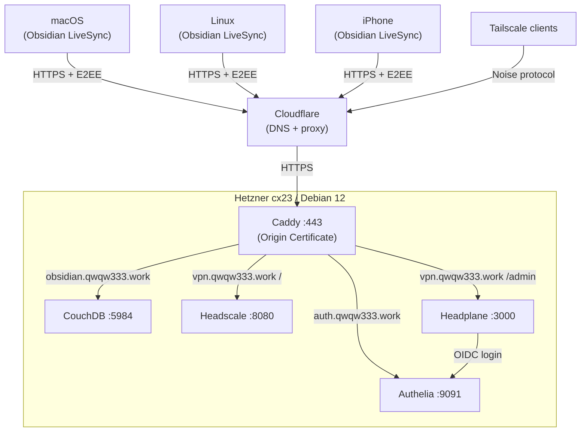

# VPS — Self-hosted Services

Private self-hosted infrastructure on Hetzner Cloud: Obsidian real-time sync (CouchDB + LiveSync), Headscale VPN with Headplane web UI, and Authelia SSO.

## Architecture



**Stack:** Terraform (Hetzner + Cloudflare) → Ansible → Docker Compose → Caddy → CouchDB / Authelia / Headscale / Headplane

## Project Structure

```
vps/
├── infra/              # Terraform — Hetzner server, firewall, Cloudflare DNS
├── ansible/            # Server configuration (7 roles)
│   └── roles/
│       ├── base/       # hostname, apt, ufw, fail2ban
│       ├── users/      # SSH user, sudo
│       ├── docker/     # Docker CE + Compose plugin + proxy network
│       ├── caddy/      # Shared Caddy reverse proxy (Origin CA cert)
│       ├── authelia/   # Self-hosted SSO/OIDC provider
│       ├── couchdb/    # CouchDB (compose.yaml), cluster init
│       └── headscale/  # Headscale VPN + Headplane web UI (OIDC via Authelia)
├── scripts/            # Helpers (generate-inventory.py, colors.sh)
└── docs/               # Detailed documentation
```

## Prerequisites

- macOS with Homebrew (or any system with Terraform + Ansible)
- [Hetzner Cloud](https://console.hetzner.cloud/) account + API token
- [Cloudflare](https://dash.cloudflare.com/) account + API token (DNS zone for your domain)
- [HCP Terraform](https://app.terraform.io/) account (free tier, for remote state)
- SSH key uploaded to Hetzner Cloud

```bash
brew install terraform ansible go-task
```

## Quick Start

### 1. Terraform — provision server and DNS

```bash
terraform login            # authenticate with HCP Terraform
cd infra && terraform init # download providers

task plan                  # review changes
task apply                 # create server + DNS records
```

This creates a Hetzner server and proxied Cloudflare A-records for `obsidian.qwqw333.work`, `vpn.qwqw333.work`, and `auth.qwqw333.work`.

### 2. Secrets — Ansible Vault

```bash
cd ansible

# Create vault password file
echo 'your-vault-password' > .vault_pass

# Edit encrypted secrets
ansible-vault edit group_vars/all/vault.yml
```

Required vault variables:

| Variable | Description |
|----------|-------------|
| `vault_couchdb_user` | CouchDB admin username |
| `vault_couchdb_password` | CouchDB admin password |
| `vault_couchdb_domain` | FQDN (e.g. `obsidian.example.com`) |
| `vault_origin_cert` | Cloudflare Origin Certificate (PEM, wildcard) |
| `vault_origin_key` | Origin Certificate private key (PEM) |
| `vault_headscale_domain` | Headscale FQDN (e.g. `vpn.example.com`) |
| `vault_headscale_base_domain` | MagicDNS base domain (must differ from headscale_domain) |
| `vault_headplane_cookie_secret` | 32-char random secret for Headplane sessions |
| `vault_authelia_domain` | Authelia FQDN (e.g. `auth.example.com`) |
| `vault_authelia_session_secret` | 64-char hex secret for Authelia sessions |
| `vault_authelia_storage_encryption_key` | 64-char hex key for SQLite encryption |
| `vault_authelia_oidc_hmac_secret` | 64-char hex HMAC secret for OIDC |
| `vault_authelia_oidc_jwks_private_key` | RSA 4096-bit private key for OIDC token signing |
| `vault_authelia_headplane_client_secret` | Plaintext OIDC client secret for Headplane |
| `vault_authelia_headplane_client_secret_hash` | pbkdf2-sha512 hash of Headplane client secret |
| `vault_authelia_user` | Authelia username |
| `vault_authelia_user_displayname` | Authelia display name |
| `vault_authelia_user_email` | Authelia user email |
| `vault_authelia_user_password_hash` | argon2id hash of Authelia user password |
| `vault_headplane_headscale_api_key` | Long-lived Headscale API key for Headplane OIDC mode |

> Generate the Origin Certificate (wildcard `*.yourdomain.com`) in Cloudflare Dashboard → SSL/TLS → Origin Server.

### 3. Ansible — configure server

```bash
cd ansible
task generate-inventory    # generate inventory from Terraform output
task play                  # deploy all services
```

### 4. Obsidian LiveSync

1. Install the **Self-hosted LiveSync** plugin
2. Set CouchDB URL: `https://obsidian.example.com`
3. Enter CouchDB credentials from vault
4. Enable E2E encryption, press **Rebuild Everything**
5. Use **Copy Setup URI** for additional devices

### 5. Authelia SSO

After the playbook runs, you need to:

1. Generate the argon2id hash for your Authelia password:

```bash
ssh root@your-server "docker run --rm authelia/authelia:latest \
  authelia crypto hash generate argon2 --password 'your_password'"
```

2. Add the hash to `vault_authelia_user_password_hash` in vault.

3. Generate a long-lived Headscale API key for Headplane:

```bash
docker exec headscale headscale apikeys create --expiration 9999d
```

4. Add the key to `vault_headplane_headscale_api_key` in vault.

5. Run `task play` again to apply the final config.

6. Open `https://vpn.example.com/admin` — click **Sign in with Authelia**.

### 6. Headscale VPN

After deployment, to register Tailscale clients:

```bash
# On the server — create a user
docker exec headscale headscale users create myuser

# On the client — connect to your Headscale server
tailscale up --login-server https://vpn.example.com
```

## Security

| Layer | Implementation |
|-------|---------------|
| **Traffic encryption** | Cloudflare proxy → Caddy with Origin Certificate |
| **End-to-end encryption** | LiveSync E2EE — notes are encrypted client-side before sync |
| **CouchDB authentication** | `require_valid_user = true` — no anonymous access |
| **Headplane authentication** | Authelia OIDC (SSO) + Headscale API key |
| **Authelia** | argon2id password hashing, file users, SQLite storage |
| **OS firewall** | UFW — only ports 22 (SSH) and 443 (HTTPS) |
| **Cloud firewall** | Hetzner Firewall — only ports 22 and 443 |
| **SSH protection** | fail2ban — brute-force mitigation |
| **Secrets management** | Ansible Vault (encrypted at rest), HCP Terraform (sensitive vars) |
| **Git safety** | `.gitignore` excludes tfvars, inventory, vault password, certificates |

## Documentation

- [docs/terraform.md](docs/terraform.md) — infrastructure, remote state, Cloudflare DNS
- [docs/ansible.md](docs/ansible.md) — roles, vault, CouchDB deployment
- [docs/livesync.md](docs/livesync.md) — Obsidian LiveSync setup
