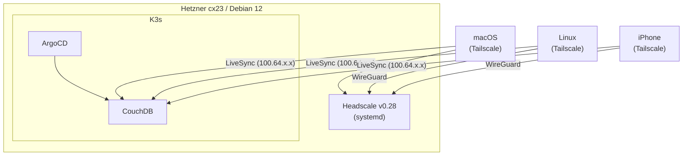

# Obsidian Sync — Self-hosted

Приватная real-time синхронизация Obsidian между macOS, Linux и iPhone через собственный VPN на Hetzner Cloud.

## Архитектура



**Стек:** Terraform → Ansible → Headscale v0.28 → K3s → ArgoCD → CouchDB

## Структура проекта

```
vps/
├── infra/                          # Terraform (Hetzner Cloud)
│   ├── Taskfile.yml                # task init, plan, apply, ip
│   ├── main.tf, variables.tf, outputs.tf
│   └── terraform.tfvars            # в .gitignore
│
├── ansible/                        # Настройка сервера
│   ├── Taskfile.yml                # task generate-inventory, play, ping
│   ├── ansible.cfg
│   ├── playbook.yml
│   ├── inventory.yml.j2            # Шаблон инвентаря (source of truth)
│   ├── group_vars/all/vault.yml    # Зашифрованные секреты (ansible-vault)
│   └── roles/
│       ├── base/                   # apt, ufw, fail2ban
│       ├── users/                  # Системные пользователи, SSH-ключи, sudo
│       ├── headscale/              # .deb + systemd + config шаблон
│       ├── k3s/                    # K3s installer
│       └── tailscale/              # Tailscale клиент → Headscale
│
├── k8s/                            # Kubernetes манифесты (GitOps)
│   ├── argocd/application.yml
│   └── apps/couchdb/              # Namespace, ConfigMap, Secret, PVC, StatefulSet, Service
│
└── scripts/
    ├── colors.sh                   # ANSI-цвета для скриптов и Taskfile
    ├── generate-inventory.py       # Генерация inventory.yml из Terraform output
    └── setup-devices.sh            # Подключение устройств к Headscale
```

## Требования

- macOS с Homebrew
- Hetzner Cloud аккаунт + API токен
- Duck DNS домен
- Tailscale на всех устройствах

```bash
brew install terraform ansible kubectl helm argocd tailscale go-task
```

## Быстрый старт

### 1. Terraform — создание сервера

```bash
cd infra
cp terraform.tfvars.example terraform.tfvars   # Указать Hetzner API токен

task plan
task apply
task ip              # Вывести IP сервера
```

### 2. Ansible — настройка сервера

```bash
cd ansible

# Настроить vault (один раз):
#   1. Записать пароль в .vault_pass
#   2. Заполнить group_vars/all/vault.yml:
ansible-vault edit group_vars/all/vault.yml
#      vault_server_url, vault_acme_email, vault_tls_letsencrypt_hostname

# Сгенерировать inventory из Terraform output:
task generate-inventory

# Проверить подключение:
task ping

# Запустить настройку:
task play
```

### 3. Headscale — подключение устройств

```bash
# На сервере:
headscale users create konoval
headscale preauthkeys create --user konoval --reusable --expiration 24h

# На каждом устройстве:
./scripts/setup-devices.sh <duckdns-домен> <auth-key>

# Проверка:
headscale nodes list
```

### 4. ArgoCD + CouchDB

```bash
# Установить ArgoCD:
kubectl create namespace argocd
kubectl apply -n argocd --server-side --force-conflicts \
  -f https://raw.githubusercontent.com/argoproj/argo-cd/stable/manifests/install.yaml

# Создать секрет CouchDB:
kubectl create secret generic couchdb-credentials \
  --namespace obsidian-sync \
  --from-literal=COUCHDB_USER=admin \
  --from-literal=COUCHDB_PASSWORD=<пароль>

# Указать URL репозитория в k8s/argocd/application.yml, затем:
kubectl apply -f k8s/argocd/application.yml

# Проверка:
kubectl get pods -n obsidian-sync
```

### 5. Obsidian LiveSync

1. Установить плагин **Self-hosted LiveSync** (Community Plugins)
2. CouchDB URL: `http://100.64.x.x:5984`, DB: `obsidian`
3. Включить E2EE, задать парольную фразу
4. **Rebuild Everything** на основном устройстве
5. **Copy Setup URI** → настроить остальные устройства

## Проверка работоспособности

```bash
terraform plan                              # No changes
kubectl get nodes                           # STATUS = Ready
kubectl get pods -n obsidian-sync           # Running

kubectl port-forward svc/couchdb -n obsidian-sync 5984:5984
curl http://localhost:5984/                 # {"couchdb":"Welcome",...}

headscale nodes list                        # Все устройства online
```

## Безопасность

| Механизм | Описание |
|----------|----------|
| **Ansible Vault** | Секреты (домен, email) зашифрованы в `group_vars/all/vault.yml` |
| **Headscale VPN** | CouchDB доступен только через WireGuard VPN (100.64.x.x) |
| **Двойной файрвол** | Hetzner Cloud Firewall (гипервизор) + UFW (ОС) |
| **fail2ban** | Защита SSH от brute-force |
| **unattended-upgrades** | Автоматические security-обновления |
| **.gitignore** | `terraform.tfvars`, `inventory.yml`, `.vault_pass`, `*.pem`, `*.key` |

### Двойной файрвол (defense-in-depth)

| Слой | Где | Управление |
|------|-----|------------|
| **Hetzner Cloud Firewall** | На уровне гипервизора, до VM | Terraform (`infra/main.tf`) |
| **UFW** | На уровне ОС внутри VM | Ansible (`roles/base/`) |

Оба настроены на одинаковые порты: `22/tcp`, `80/tcp`, `443/tcp`, `3478/udp`, `41641/udp`.
