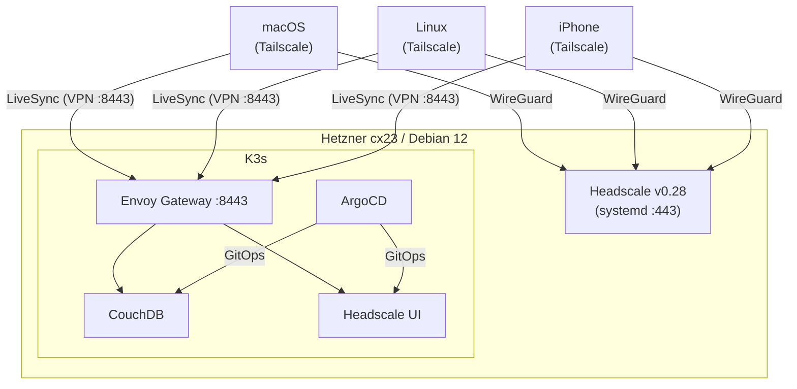

# Obsidian Sync — Self-hosted

Приватная real-time синхронизация Obsidian между macOS, Linux и iPhone через собственный VPN на Hetzner Cloud.

## Архитектура



**Стек:** Terraform → Ansible → Headscale → K3s → ArgoCD → Envoy Gateway → Sealed Secrets → CouchDB

## Структура проекта

```
vps/
├── infra/              # Terraform (Hetzner Cloud)
├── ansible/            # Настройка сервера (5 ролей)
├── k8s/
│   ├── argocd/         # ArgoCD Applications
│   ├── infra/gateway/  # GatewayClass, Gateway, Headscale API proxy
│   └── apps/           # CouchDB, Headscale UI
├── scripts/            # Утилиты (colors.sh, generate-inventory.py)
└── docs/               # Документация (terraform, ansible, kubernetes)
```

## Требования

- macOS с Homebrew
- Hetzner Cloud аккаунт + API токен
- Duck DNS домен
- Tailscale на всех устройствах

```bash
brew install terraform ansible kubectl helm argocd kubeseal tailscale go-task
```

## Быстрый старт

### 1. Terraform — создание сервера

```bash
cd infra
task plan
task apply
```

### 2. Ansible — настройка сервера

```bash
cd ansible
ansible-vault edit group_vars/all/vault.yml   # Заполнить vault-переменные
task generate-inventory
task play                                      # Один прогон — всё автоматически
```

### 3. ArgoCD + K8s сервисы

```bash
# На сервере (через SSH):
kubectl create namespace argocd
kubectl apply -n argocd --server-side --force-conflicts \
  -f https://raw.githubusercontent.com/argoproj/argo-cd/stable/manifests/install.yaml
kubectl apply -f k8s/argocd/

# Локально — запечатать секрет CouchDB:
kubeseal ...  # Подробнее: docs/kubernetes.md
```

### 4. Подключение устройств

```bash
# Через Headscale UI: http://k3s-01.hs.local:8443/web
# Или через SSH на сервер: headscale preauthkeys create --user 1 --expiration 24h
# На устройстве: tailscale up --login-server=https://<domain> --authkey=<key>
```

### 5. Obsidian LiveSync

1. Установить плагин **Self-hosted LiveSync**
2. CouchDB URL: `http://k3s-01.hs.local:8443/couchdb`
3. Включить E2EE, **Rebuild Everything**, **Copy Setup URI**

## Документация

- [docs/terraform.md](docs/terraform.md) — инфраструктура, remote state
- [docs/ansible.md](docs/ansible.md) — роли, vault, preauthkey flow
- [docs/kubernetes.md](docs/kubernetes.md) — ArgoCD, Sealed Secrets, Envoy Gateway, маршруты

## Безопасность

| Механизм | Описание |
|----------|----------|
| **Ansible Vault** | Секреты зашифрованы в `vault.yml` |
| **Sealed Secrets** | K8s секреты зашифрованы в git, расшифровывает только кластер |
| **Headscale VPN** | Все сервисы доступны только через WireGuard VPN |
| **Envoy Gateway** | Порт 8443 закрыт UFW извне, доступен только через VPN |
| **Двойной файрвол** | Hetzner Cloud Firewall + UFW |
| **fail2ban** | Защита SSH от brute-force |
| **.gitignore** | `terraform.tfvars`, `inventory.yml`, `.vault_pass`, `*.pem`, `*.key` |
