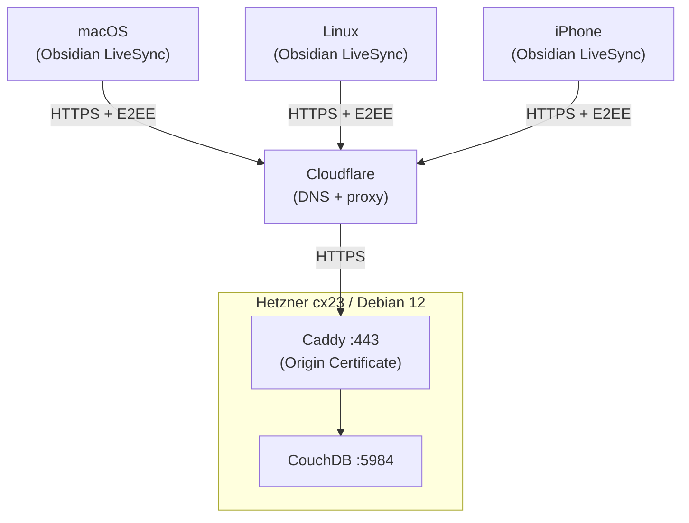

# Obsidian Sync — Self-hosted

Private real-time [Obsidian](https://obsidian.md) synchronization across macOS, Linux, and iOS via a self-hosted CouchDB on Hetzner Cloud.

## Architecture



**Stack:** Terraform (Hetzner + Cloudflare) → Ansible → Docker Compose → Caddy → CouchDB

## Project Structure

```
vps/
├── infra/              # Terraform — Hetzner server, firewall, Cloudflare DNS
├── ansible/            # Server configuration (4 roles)
│   └── roles/
│       ├── base/       # hostname, apt, ufw, fail2ban
│       ├── users/      # SSH user, sudo
│       ├── docker/     # Docker CE + Compose plugin
│       └── couchdb/    # Caddy + CouchDB (docker-compose), cluster init
├── scripts/            # Helpers (generate-inventory.py, colors.sh)
└── docs/               # Detailed documentation
```

## Prerequisites

- macOS with Homebrew (or any system with Terraform + Ansible)
- [Hetzner Cloud](https://console.hetzner.cloud/) account + API token
- [Cloudflare](https://dash.cloudflare.com/) account + API token (DNS zone for your domain)
- [HCP Terraform](https://app.terraform.io/) account (free tier, for remote state)
- SSH key uploaded to Hetzner Cloud

```bash
brew install terraform ansible go-task
```

## Quick Start

### 1. Terraform — provision server and DNS

```bash
terraform login            # authenticate with HCP Terraform
cd infra && terraform init # download providers

task plan                  # review changes
task apply                 # create server + DNS record
```

This creates a Hetzner server and a proxied Cloudflare A-record pointing to it.

### 2. Secrets — Ansible Vault

```bash
cd ansible

# Create vault password file
echo 'your-vault-password' > .vault_pass

# Edit encrypted secrets
ansible-vault edit group_vars/all/vault.yml
```

Required vault variables:

| Variable | Description |
|----------|-------------|
| `vault_couchdb_user` | CouchDB admin username |
| `vault_couchdb_password` | CouchDB admin password |
| `vault_couchdb_domain` | FQDN (e.g. `obsidian.example.com`) |
| `vault_origin_cert` | Cloudflare Origin Certificate (PEM) |
| `vault_origin_key` | Origin Certificate private key (PEM) |

> Generate the Origin Certificate in Cloudflare Dashboard → SSL/TLS → Origin Server.

### 3. Ansible — configure server

```bash
cd ansible
task generate-inventory    # generate inventory from Terraform output
task play                  # install Docker, deploy CouchDB + Caddy
```

### 4. Obsidian LiveSync

1. Install the **Self-hosted LiveSync** plugin
2. Set CouchDB URL: `https://obsidian.example.com`
3. Enter CouchDB credentials from vault
4. Enable E2E encryption, press **Rebuild Everything**
5. Use **Copy Setup URI** for additional devices

## Security

| Layer | Implementation |
|-------|---------------|
| **Traffic encryption** | Cloudflare proxy → Caddy with Origin Certificate |
| **End-to-end encryption** | LiveSync E2EE — notes are encrypted client-side before sync |
| **CouchDB authentication** | `require_valid_user = true` — no anonymous access |
| **OS firewall** | UFW — only ports 22 (SSH) and 443 (HTTPS) |
| **Cloud firewall** | Hetzner Firewall — only ports 22 and 443 |
| **SSH protection** | fail2ban — brute-force mitigation |
| **Secrets management** | Ansible Vault (encrypted at rest), HCP Terraform (sensitive vars) |
| **Git safety** | `.gitignore` excludes tfvars, inventory, vault password, certificates |

## Documentation

- [docs/terraform.md](docs/terraform.md) — infrastructure, remote state, Cloudflare DNS
- [docs/ansible.md](docs/ansible.md) — roles, vault, CouchDB deployment
